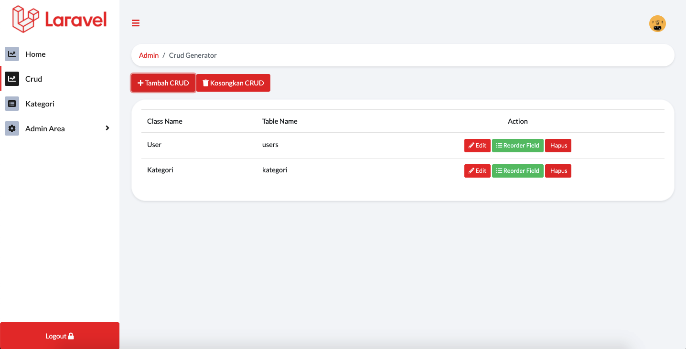
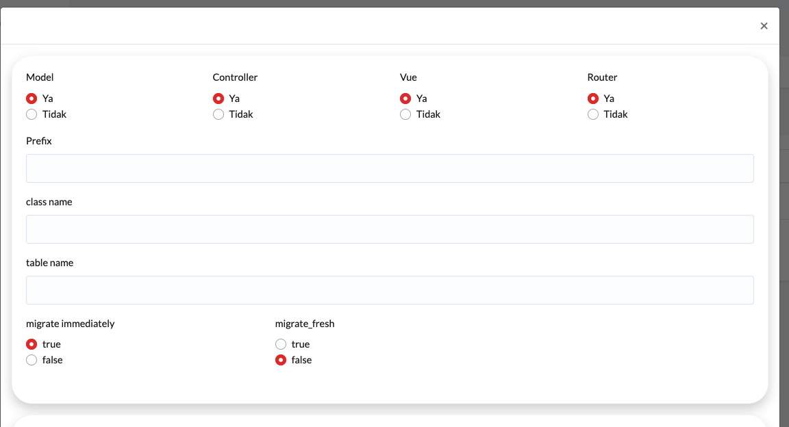
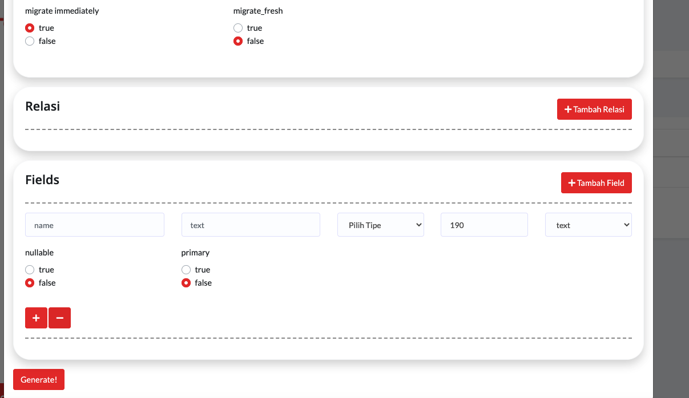

# KEMOSKELETON LARAVEL V1.0

**Admin crud generator with vue js**  

  

## LIBRARY

- <a href="https://github.com/svenluijten/artisan-view">svenluijten artisan-view</a>
- <a href="https://github.com/bootstrap-vue/bootstrap-vue">bootstrap-vue</a> 
- <a href="https://github.com/yajra/laravel-datatables">laravel-datatables</a>

## Index Vue  
_- check data upload set true jika ingin enable upload_  

## To Do List  

 - export excel

